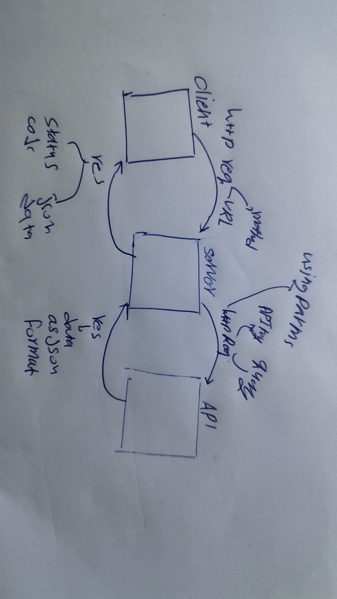

# Movies-Library

**Author Name**: Saker Ahmad 

## WRRC

## Overview

## Getting Started
<!-- What are the steps that a user must take in order to build this app on their own machine and get it running? -->
1.npm node init -y 
3.creat index.js 
2.npm install express 
3.include  express framework by const express = require('express');
4.determinant your port
5.then handle what the client req and waht you shuld res 
6.Express doc
7.NPM doc
8.Dotenv
9.axios

## Project Features
this server have  Home Page Endpoint: /  that Respons is  title , poster_path ,overview
and the Favorite Page Endpoint: “/favorite  Respons  Welcome to Favorite Page and Handle errors
that Respons  status code and  responseText like "Sorry, something went wrong"

now my server use 3thd paert API si it can retrive the data drom this API and no needed to save the data insider the server.