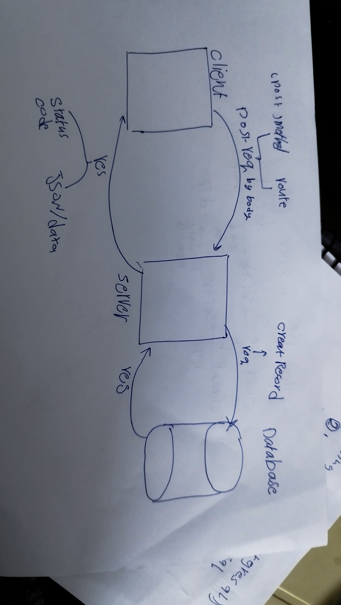

# Movies-Library

**Author Name**: Saker Ahmad 

## WRRC

## Overview

## Getting Started
<!-- What are the steps that a user must take in order to build this app on their own machine and get it running? -->
1.npm node init -y 
3.creat index.js 
2.npm install express 
3.include  express framework by const express = require('express');
4.determinant your port
5.then handle what the client req and waht you shuld res 
6.Express doc
7.NPM doc
8.Dotenv
9.axios
10. npm install pg // to make sql languge run inside my server 

## Project Features
A RESTful API built using Node.js and Express.js
Connects to a PostgreSQL database to perform CRUD operations on data
Has two endpoints:
/addMovie: Creates a POST request to save a specific movie to the database along with personal comments
/getMovies: Creates a GET request to get all the data from the database
Uses body-parser middleware to parse incoming request bodies in a middleware before your handlers, available under the req.body property
Uses cors middleware to enable Cross-Origin Resource Sharing
Uses the dotenv package to load environment variables from a .env file
Uses error handling middleware to handle errors and return a 500 status code
Uses destructuring to extract properties from the request body
Uses promises to handle asynchronous database queries and catch errors
Uses the Client class from the pg package to connect to a PostgreSQL database
Uses SQL statements to perform CRUD operations on the database
